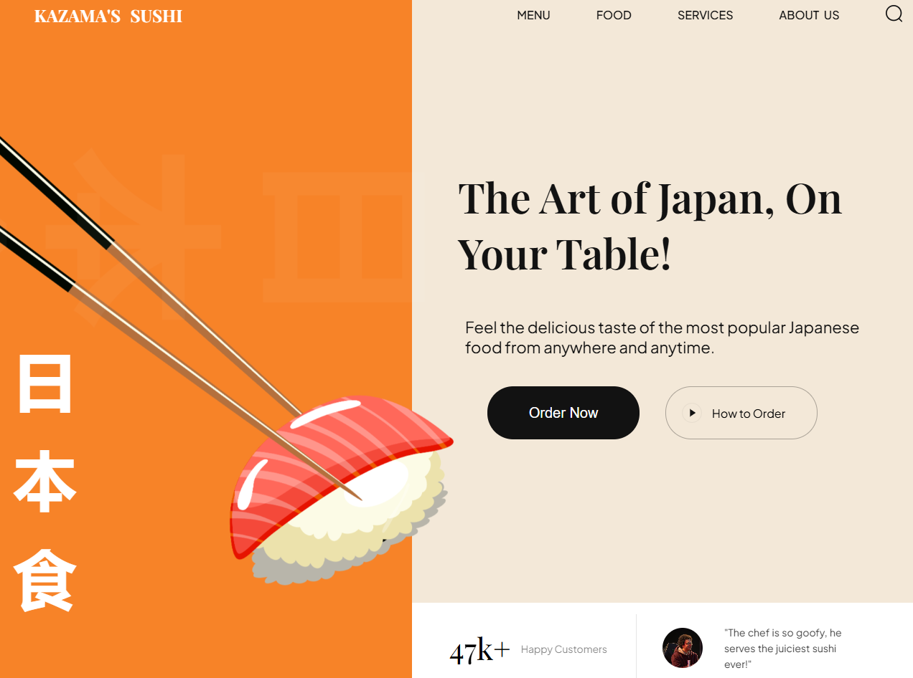
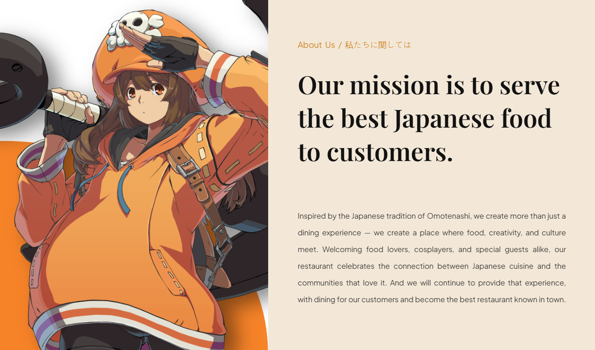
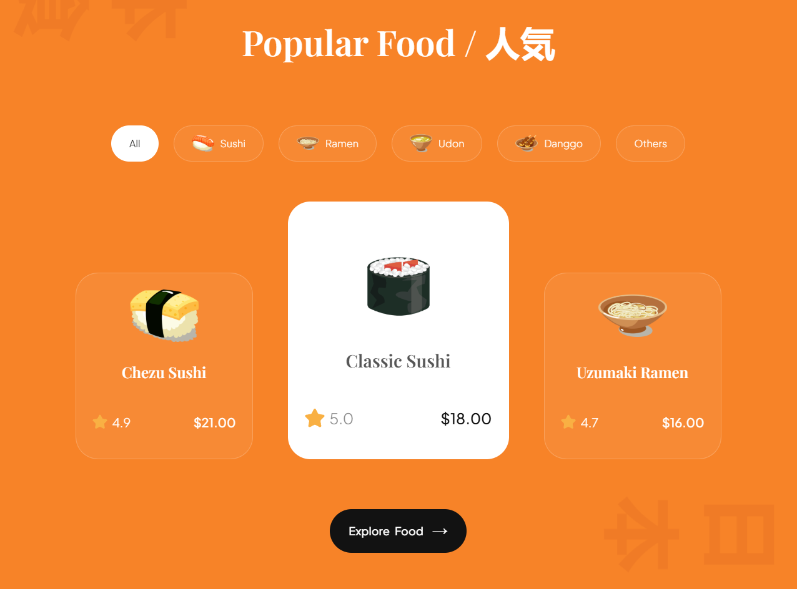
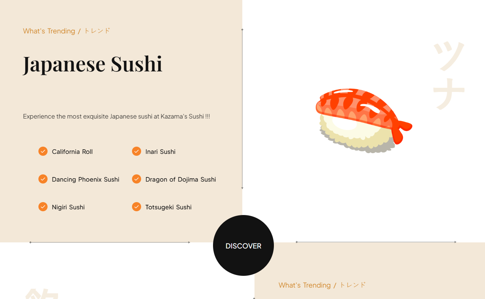
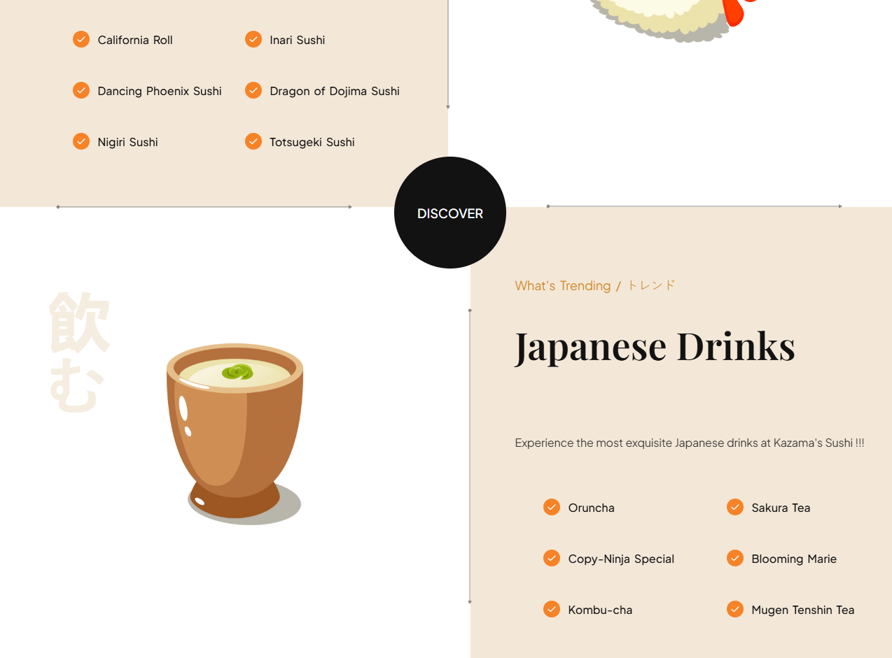
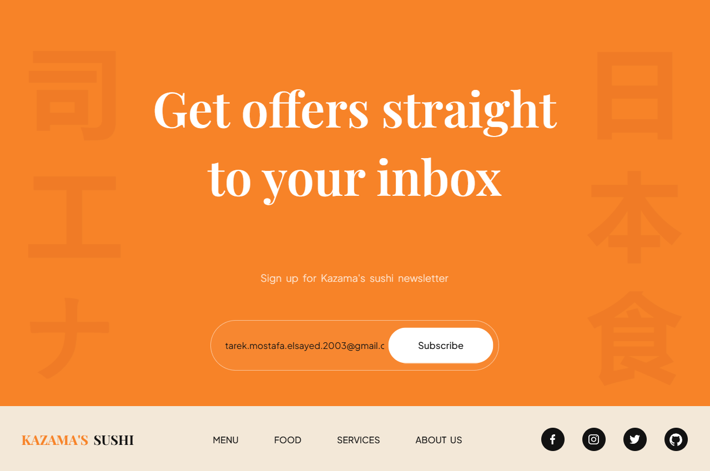

# PRODIGY_WD_01 🍣

This is task number 1 following my internship for Prodigy InfoTech and for this task I will create a sushi landing page that uses HTML, CSS &amp; Javascript. I will use the HTML to structure the menu, CSS to style it as well as use Javascript to add interactivity such as changing the font color or background color of the menu when it is hovered over

Welcome to **Kazama's Sushi** — a vibrant and interactive landing page for a Japanese restaurant built with pure HTML, CSS &amp; JavaScript. This project brings the spirit of Japanese cuisine and the warmth of Omotenashi (おもてなし) to the web with modern animations, scroll-triggered reveals, and a playful anime-inspired aesthetic. 🎌✨

---

## 🧭 Sections Overview

| Section | Description |
|---------|-------------|
| **Header** 🏠 | A sticky navigation bar featuring the Kazama's Sushi logo, smooth-scrolling menu links (Menu, Food, Services, About Us), a search icon, and a mobile-friendly hamburger menu. |
| **Hero** 🎬 | A bold full-width hero section with sushi imagery, Japanese calligraphy, two CTA buttons ("Order Now" & "How to Order"), a live animated customer counter (46k+ fluctuating between 46–49), and an auto-rotating testimonial carousel that swaps reviews with a swipe animation every 5 seconds. |
| **About Us** 📖 | Our mission statement rooted in the Japanese tradition of Omotenashi — where food, creativity, and culture meet. Welcomes cosplayers, food lovers, and special guests alike. Fades in as you scroll. |
| **Popular Food** 🍱 | A filterable food catalogue with categories: All, Sushi, Ramen, Udon, Danggo, and Others. Each item is displayed as a card with a star rating, price tag, and an active-card highlight effect. |
| **Trending** 🔥 | Two subsections — **Trending Sushi** and **Trending Drinks** — each listing featured menu items with checkmark icons and decorative arrow graphics. Includes a floating "Discover" badge. |
| **Subscription** 📬 | A newsletter signup section with decorative Japanese background text (司工ナ / 日本食), an email input field, and a subscribe button. |
| **Footer** 👣 | Restaurant logo, quick navigation links, and social media icons (Facebook, Instagram, Twitter, GitHub) with a link to the project repository. |

---

## ✨ Interactive Features

- **🔄 Auto-rotating reviews** — Customer testimonials automatically cycle every 5 seconds with a smooth swipe-in animation and updated avatar.
- **🔢 Animated counter** — The "Happy Customers" digit counter smoothly animates up and down between 46k and 49k with a flip-digit effect.
- **📜 Scroll reveal animations** — All sections fade and slide into view as you scroll down, powered by the Intersection Observer API.
- **🎵 Hidden background music** — Press `Alt + Shift + O` to toggle a hidden background track (Guilty Gear Strive OST — "The Disaster of Passion").

---

## 🛠️ Built With

| Tech | Purpose |
|------|---------|
|  | Structure & markup |
|  | Styling, layout & responsive design |
|  | Interactivity, animations & DOM manipulation |

---

## 📸 Screenshots

### Hero Section

### About Us Section

### Popular Section

### Trending Section

### Subscription Section

---

## 🙏 Credits

Special thanks to the following volunteers for their contributions and support:

| Name | GitHub | LinkedIn |
|------|--------|----------|
| Zeyad Tantawy | [@Zeyad-Tantawy1](https://github.com/Zeyad-Tantawy1) | [LinkedIn](https://www.linkedin.com/in/zeyad-tantawy/) |
| Mohamed Koshty | [@Koshty](https://github.com/Koshty) | [LinkedIn](https://www.linkedin.com/in/mohamed-koshty-875360279/) |
| Mohamed (Jaxon) Mostafa | [@theJaxon](https://github.com/theJaxon) | [LinkedIn](https://www.linkedin.com/in/mohamedmostafaels/) |

---

Made with ❤️ as part of the Prodigy InfoTech internship.
